<div align="center">

# Send From China Agent Core

### Publish once. Expose only what each tenant is allowed to see.

A self-hosted catalog gateway that gives commerce agents a guarded HTTP and MCP
surface—without connecting the runtime to your private systems.

[](https://github.com/SuntekCorps-xLab/send-from-china-agent-core/actions/workflows/ci.yml)
[](governance-worker/package.json)
[](contracts/openapi.yaml)
[](CHANGELOG.md)
[](docs/SECURITY_MODEL.md)
[](LICENSE)

<br>



<p>
  <a href="#try-the-zero-account-sandbox"><strong>⚡ Try sandbox</strong></a> ·
  <a href="#connect-an-mcp-client"><strong>🔌 MCP setup</strong></a> ·
  <a href="#publish-your-own-catalog"><strong>📦 Publisher</strong></a> ·
  <a href="docs/SECURITY_MODEL.md"><strong>🛡️ Security model</strong></a> ·
  <a href="docs/ARCHITECTURE.md"><strong>🏗️ Architecture</strong></a> ·
  <a href="ROADMAP.md"><strong>🗺️ Roadmap</strong></a>
</p>

</div>

> [!IMPORTANT]
> Agent Core is a security-focused reference gateway, not a hosted marketplace.
> It deliberately has no customer, payment, order, checkout, supplier, or
> product-write connection. The included sourcing lifecycle is a synthetic,
> non-purchasable fixture for client integration tests.

To connect an external application to this contract or to a compatible hosted
deployment, use the dependency-free [JavaScript SDK](sdk/README.md) and follow
the [Hosted Platform quickstart](docs/HOSTED_PLATFORM_QUICKSTART.md). The SDK
keeps catalog discovery, dynamic sourcing, and merchant purchase handoff
separate, and never handles payment credentials.

External agents can use the versioned
[Search Contract v2](docs/SEARCH_CONTRACT_V2.md) to keep product identity,
explicit hard constraints, soft ranking context, and transaction context
separate. The additive SDK 1.1 API includes an explicit compatibility adapter
for the stable `product_search` v1 tool.

## What you can build with it

Agent Core turns a pre-published product snapshot into a guarded HTTP and MCP
surface. An application, shopping assistant, or automation can:

- 🔎 **Search:** query a catalog without receiving unrestricted enumeration access;
- 🧾 **Public product facts:** read tenant-visible records through a positive field allowlist;
- 🧮 **Non-binding estimate:** request a short-lived catalog estimate that explicitly excludes shipping and tax;
- 🪪 **Tenant scope:** inspect its own scopes and explicit non-transactional permissions;
- 🧭 **Sourcing preview:** run an idempotent fixture preview after a catalog miss.

The gateway has no connection to a private catalog, supplier system, store,
customer account, payment provider, or order system. It makes no outbound
runtime network request. The included local publisher turns your JSON or JSONL
catalog into a validated build-time snapshot without sending it anywhere.

<table>
  <tr>
    <td width="33%" valign="top"><strong>🔐 Guarded by default</strong><br>Tenant keys, bounded search, quotas, generic errors, and fail-closed configuration.</td>
    <td width="33%" valign="top"><strong>🧱 Positive data policy</strong><br>Every product response is rebuilt from an explicit public-field allowlist.</td>
    <td width="33%" valign="top"><strong>↔️ One policy, two protocols</strong><br>HTTP and MCP calls share the same snapshot, tenant scope, and non-transactional boundary.</td>
  </tr>
</table>

## Try the zero-account sandbox

Run the real HTTP and MCP Worker contract against the checked-in synthetic
snapshot without registering, configuring a tenant, or exposing a credential to
the browser:

```bash
npm ci
npm run sandbox
```

Open `http://127.0.0.1:8787/sandbox`. The workbench includes executable HTTP
search, Search Contract v2, MCP discovery and product search, plus a terminal
miss → explicit confirmation → illustrative sourcing recipe. All sandbox cards
are synthetic; there are no carrier rates, commerce writes, or external image
requests.

The browser-safe `/sandbox/*` routes use a process-only ephemeral tenant. The
canonical `/api/*` and `/mcp` routes keep their normal bearer-authentication
contract. Sandbox responses apply a final conservative presentation overlay:
every product and estimate is illustrative, unavailable, and non-purchasable,
and purchase or external URL evidence is removed. Sandbox discovery points MCP
clients to `/sandbox/mcp`; canonical deployments still require bearer auth.
See the [sandbox boundary and MCP setup](docs/SANDBOX.md).

### Copy a working first call

The tested [`recipes/`](recipes/README.md) directory provides curl, MCP,
JavaScript, and Python paths against the same zero-account sandbox. To start
from an editable application instead of a single call, use the dependency-free
[`Agent Core JavaScript starter`](starters/agent-core-js/README.md).

## From private input to a public snapshot

Publishing is a local build step, not a runtime sync. User-selected catalog input
and the identifier key stay on the publisher side; only a validated snapshot of
allowed public fields crosses into the Worker. Source identifiers, unknown
fields, and the key never enter the snapshot or publisher report.



## 60-second local run

Requirements: Node.js 22+ and npm.

```bash
git clone https://github.com/SuntekCorps-xLab/send-from-china-agent-core.git
cd send-from-china-agent-core
npm ci
npm run setup
npm run verify
npm run dev
```

`npm run setup` installs the locked Worker dependency and creates
`governance-worker/.dev.vars` only when the file does not already exist. The
checked-in key is an obvious local test value. Replace it before sharing a
development deployment. In another terminal, set the same value locally:

```bash
export TENANT_KEY="key_test_alpha_1234567890"
```

PowerShell equivalent:

```powershell
$env:TENANT_KEY = "key_test_alpha_1234567890"
```

Check the public health endpoint:

```bash
curl http://localhost:8787/health
```

Search the five products visible to the sample tenant:

```bash
curl "http://localhost:8787/api/search?q=desk&limit=5" \
  -H "Authorization: Bearer ${TENANT_KEY}"
```

Read one product by public slug:

```bash
curl http://localhost:8787/api/products/modular-desk-organizer \
  -H "Authorization: Bearer ${TENANT_KEY}"
```

Create a non-binding catalog estimate (not a carrier shipping rate):

```bash
curl http://localhost:8787/api/quote \
  -H "Authorization: Bearer ${TENANT_KEY}" \
  -H "Content-Type: application/json" \
  -d '{"public_id":"A1b2C3d4E5f6G7h8J9k0Lm","quantity":2,"ship_to":"US"}'
```

Expected quote shape:

```json
{
  "quote_id": "quote_<random-id>",
  "quote_kind": "catalog_estimate",
  "public_id": "A1b2C3d4E5f6G7h8J9k0Lm",
  "unit_price": {"amount": 24.9, "currency": "USD"},
  "quantity": 2,
  "ship_to": "US",
  "availability": "in_stock",
  "shipping_included": false,
  "tax_included": false,
  "destination_evaluated": false,
  "expires_at": "<ISO-8601 timestamp>",
  "binding": false
}
```

The country code is preserved as request context only. This reference runtime
does not connect to a carrier, calculate landed cost, or validate a delivery
destination.

## Connect an MCP client

MCP discovery is public so clients can call `initialize` and `tools/list`
before a key is configured. Every `tools/call` requires a tenant credential.

Use this server definition in an MCP client that supports custom headers:

```json
{
  "mcpServers": {
    "commerce-catalog": {
      "url": "http://localhost:8787/mcp",
      "headers": {
        "Authorization": "Bearer ${TENANT_KEY}"
      }
    }
  }
}
```

Available tools:

| Tool | Purpose |
| --- | --- |
| `product_search` | Criteria-first bounded search with terminal status |
| `search_catalog` | Tenant-scoped catalog search |
| `get_product` | Product detail by public slug |
| `get_quote` | Short-lived catalog estimate; no shipping or tax |
| `get_agent_access` | Tenant scope and permissions |
| `create_sourcing_task` | Idempotent fixture preview |
| `get_sourcing_task` | Preview task status |
| `list_sourcing_results` | Paginated non-purchasable preview results |

There are no cart, checkout, order, payment, refund, product-write, or publish
tools in this repository.

### One guarded runtime, two protocols

HTTP and MCP can discover the service anonymously, but every product request or
`tools/call` crosses the same deployment-held credential check, tenant scope,
quota, published snapshot, and positive response policy. This reference does not
issue keys or provide a self-service OAuth or registration flow; deployment
operators configure tenant credentials outside the repository.



### Optional Agent Skill

The repository includes an installable example under
[`skills/send-from-china-catalog`](skills/send-from-china-catalog). It teaches a
compatible coding agent the catalog-first flow, catalog-estimate boundary, and
confirmed sourcing-preview discipline. The skill does not contain an endpoint
or tenant key; configure the MCP server separately.

## Publish your own catalog

The gateway includes a standard-library Python publisher. It accepts user-owned
JSON or JSONL, strips fields outside the public contract, creates stable opaque
identifiers using a key kept in your environment, resolves tenant scopes, and
writes the final snapshot atomically.

```bash
export CATALOG_ID_KEY="$(python -c 'import secrets; print(secrets.token_urlsafe(32))')"
python publisher/build_snapshot.py \
  --source publisher/samples/catalog-input.sample.json \
  --output build/published-catalog.json \
  --report build/publisher-report.json
node scripts/validate-snapshot.mjs build/published-catalog.json
```

The same input and identifier key produce the same public product IDs. Neither
the input `source_id` nor the key appears in the snapshot or report. The
`build/` directory is ignored by Git.

To run the Worker with the generated snapshot, copy it over the development
fixture before bundling:

```bash
cp build/published-catalog.json fixtures/published-catalog.sample.json
cd governance-worker
npm run verify
npm run dev
```

See the complete [publisher guide](publisher/README.md) and
[publisher input schema](contracts/publisher-input.schema.json).

The snapshot contract contains:

- `generated_at` and `valid_until` freshness boundaries;
- public product records accepted by the field allowlist;
- opaque 22-character public product identifiers;
- per-tenant product scopes and price tiers.

Snapshot validation is atomic: one invalid record rejects the whole snapshot.
The gateway never reads a local file or remote service at runtime. A production
build should treat its input, identifier key, tenant configuration, generated
snapshot, and deployment bundle as private artifacts. See
[the identifier contract](publisher/id-mapping.md) and
[architecture](docs/ARCHITECTURE.md).

## Configure tenants

`TENANT_KEYS` is a JSON object injected through `.dev.vars` locally or your
deployment platform's secret store:

```text
TENANT_KEYS={"<random-key>":{"tenant_id":"tenant_alpha","max_page_size":5,"daily_quota":100}}
```

Generate a new local key and ready-to-copy JSON value without adding a
dependency:

```bash
npm run tenant:key -- tenant_alpha
```

The command prints a secret once. Move it to `.dev.vars` or a secret manager and
never commit the output. There is no self-service registration endpoint in this
reference server; a deployment operator provisions and revokes tenant keys.

The tenant identifier selects the matching scope in the published snapshot.
Optional deployment fields are `product_ids`, `price_tier`,
`allow_full_enumeration`, `max_page_size`, and `daily_quota`.

Restricted tenants cannot call `GET /api/catalog`. They can use bounded search,
and search stops returning cursors after 200 results. Quota errors return HTTP
429 with `Retry-After`. The in-memory counter is a Phase 1 reference and must be
replaced by durable storage for multi-isolate production use.

## HTTP API

| Method | Path | Credential | Purpose |
| --- | --- | --- | --- |
| `GET` | `/.well-known/send-from-china.json` | No | Authentication and capability discovery |
| `GET` | `/health` | No | Snapshot freshness and gateway state |
| `GET` | `/api/catalog` | Yes | Full listing only for explicitly allowed tenants |
| `GET` | `/api/search?q=...` | Yes | Bounded tenant-scoped search |
| `POST` | `/api/search/v2` | Yes | Product-first Search Contract v2 |
| `GET` | `/api/products/:slug` | Yes | One tenant-visible product |
| `POST` | `/api/quote` | Yes | Short-lived catalog estimate; excludes shipping and tax |
| `POST` | `/api/chat` | Yes | Deterministic search conversation example |
| `POST` | `/mcp` | Mixed | Public discovery; authenticated tool calls |

The complete request and error contract is in
[contracts/openapi.yaml](contracts/openapi.yaml).

## Security properties

Three invariants are enforced in code and tests:

1. Worker code contains no private system address or credential.
2. Worker runtime code makes no outbound request.
3. Product responses pass through a positive field allowlist.

Additional controls include constant-time credential comparison, tenant product
isolation, page-size limits, anti-enumeration behavior, daily quotas, generic
errors, restrictive response headers, and a repository safety scan.

CI also runs the Search Contract SDK tests and generated-type staleness check,
then uploads SPDX 2.3 SBOM documents for Agent Core, the dependency-free SDK,
and the Worker's locked build and test dependency graph.

Run the full verification suite:

```bash
cd governance-worker
npm run verify
cd ..
node scripts/scan-public.mjs .
```

After starting the Worker, exercise only its public HTTP and MCP surface:

```bash
export TENANT_KEY="<your-local-key>"
npm run smoke
```

Use `npm run smoke -- --url https://your-worker.example` for a deployed
environment. The smoke test confirms public discovery, authenticated search,
and fail-closed unauthenticated access without reading deployment internals.

See [Security model](docs/SECURITY_MODEL.md) for the exact test files behind
each claim.

## Repository map

```text
contracts/            Snapshot schema and OpenAPI contract
fixtures/             Synthetic published snapshot for local use
governance-worker/    HTTP and MCP gateway with tests
sandbox/              Zero-account local HTTP and MCP workbench
publisher/            Public-side publishing rules, never private mappings
etl-pipeline/          File-only product validation examples
docs/                  Architecture, deployment, operations, and security
scripts/               Repository safety scanner
```

## Project boundary

Version `1.0.0` is the first stable public contract for the guarded catalog
gateway and local snapshot publisher. It is usable for local integration,
contract tests, and adapting a user-owned catalog. It is not a hosted
marketplace, carrier-rate service, or purchasing system and cannot complete a
purchase.

Before adding a write-capable system, independently design durable identity,
authorization, idempotency, audit logging, retention, deletion, pricing,
inventory, tax, shipping, returns, and incident response.

## License and support

Licensed under Apache-2.0. See [LICENSE](LICENSE) and [NOTICE](NOTICE).
Report vulnerabilities privately through [SECURITY.md](SECURITY.md). Use the
issue templates for reproducible bugs, setup questions, and feature proposals;
see [Support](SUPPORT.md) and the [public roadmap](ROADMAP.md) before opening an
issue.
