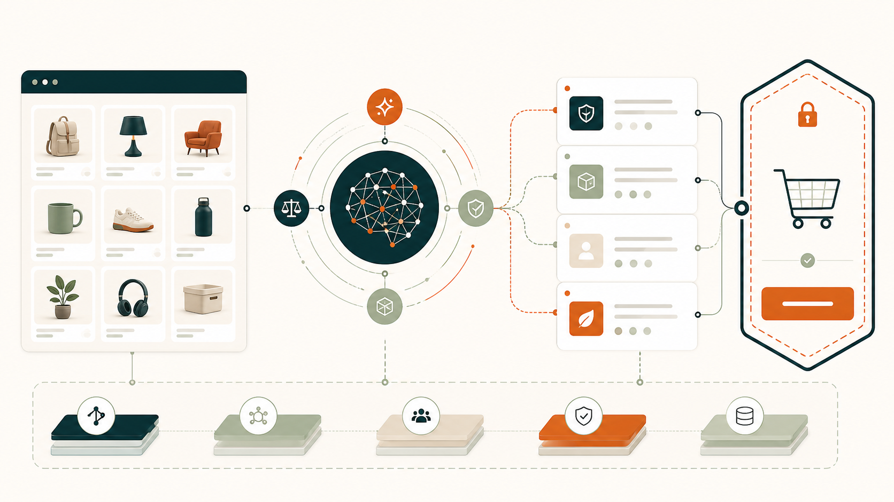
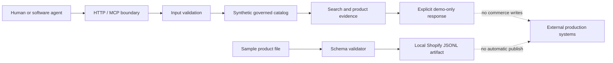

<div align="center">

# Send From China Agent Core

**A governed, agent-ready commerce reference for catalog discovery and safe tool use.**

[](#project-status)
[](https://github.com/Peter-Fu-Collab/send-from-china-agent-core/actions/workflows/ci.yml)
[](governance-worker/package.json)
[](.github/workflows/ci.yml)
[](LICENSE)



</div>

## Why this exists

Commerce agents need more than search. They need explicit facts, bounded tools,
stable identifiers, honest availability semantics, and a hard boundary before
any customer or merchant write. This repository is a small, runnable reference
for those foundations.

It deliberately uses synthetic products and exposes no order, payment, publish,
supplier, customer-account, or production-store capability.

## What is included

| Area | Included capability | Safety posture |
| --- | --- | --- |
| Catalog | Cursor pagination, search, product detail | Synthetic data only |
| Agent API | HTTP endpoints and JSON responses | Read-only |
| MCP | `search_catalog`, `get_product` | No write tools |
| Conversation | Deterministic criteria example | Not represented as a purchasing agent |
| ETL | Schema validation and Shopify JSONL file build | Writes local files only |
| Operations | Health check, CI evidence, dependency and safety scans | No production bindings |

## Quick start

Requirements: Node.js 22+ and Python 3.11+.

```bash
git clone https://github.com/Peter-Fu-Collab/send-from-china-agent-core.git
cd send-from-china-agent-core/governance-worker
npm ci
npm run verify
npm run dev
```

In another terminal:

```bash
curl http://localhost:8787/health
curl "http://localhost:8787/api/catalog?limit=3"
curl "http://localhost:8787/api/search?q=desk%20organizer"
```

Every demo product is returned as `purchasable=false`,
`availability=demo_only`, and `source=synthetic_demo`.

## Agent interface

### HTTP surface

| Method | Path | Purpose |
| --- | --- | --- |
| `GET` | `/health` | Readiness and operating mode |
| `GET` | `/api/catalog` | Cursor-paginated synthetic catalog |
| `GET` | `/api/search?q=...` | Ranked synthetic search |
| `GET` | `/api/products/:handle` | One synthetic product |
| `POST` | `/api/chat` | Deterministic conversation example |
| `POST` | `/mcp` | Read-only MCP server |

### MCP example

```bash
curl http://localhost:8787/mcp \
  -H "Content-Type: application/json" \
  -d '{"jsonrpc":"2.0","id":1,"method":"tools/call","params":{"name":"search_catalog","arguments":{"query":"desk organizer","limit":3}}}'
```

The MCP server has exactly two tools. Neither can create a cart, checkout,
order, payment, sourcing task, or catalog write.

## Architecture



See [Architecture](docs/ARCHITECTURE.md) and
[Security model](docs/SECURITY_MODEL.md) for trust boundaries and failure
behavior.

## Product import dry run

The ETL example builds files only. It does not connect to Shopify.

```bash
python etl-pipeline/scripts/validate_import.py \
  --source etl-pipeline/samples/sample_product.json \
  --output build/products.normalized.json \
  --report build/validation-report.json

python etl-pipeline/scripts/build_shopify_jsonl.py \
  --input build/products.normalized.json \
  --output build/shopify-products.jsonl \
  --manifest build/import-manifest.json
```

The sample image URL is a placeholder. A deployer must verify product data and
image rights before using any generated artifact.

## Configuration

The Worker has one non-secret setting:

```text
ALLOWED_ORIGINS=http://localhost:8787,http://127.0.0.1:8787
```

Unknown browser origins fail closed. Requests without an `Origin` header are
accepted for server-to-server and command-line use. No secret or persistent
store is needed for this reference.

## Project status

Current version: `0.1.0-rc.4`.

This is a release candidate and engineering reference, not a hosted marketplace
or a production purchasing system. The hosted product has a broader contract;
production behavior must not be inferred from this synthetic starter.

## Production boundary

A real deployment must independently provide and review:

- catalog ownership, compliance, media rights, and lifecycle controls;
- authentication, authorization, customer isolation, and deletion;
- truthful price, inventory, tax, shipping, and purchasability semantics;
- durable idempotency for sourcing, cart, checkout, order, and refund writes;
- queues, replay controls, observability, retention, and incident response;
- model privacy and prompt-injection controls when an LLM is introduced.

Do not attach write-capable systems to this starter without an authorization
design, durable idempotency, and an independent security review.

## Repository map

```text
governance-worker/  Cloudflare Worker, HTTP/MCP contracts, tests
etl-pipeline/       Product schema, synthetic sample, file-only transforms
docs/               Architecture, security, deployment, operations
scripts/            Repository safety scanner
.github/            CI, dependency review, issue and review templates
```

## Documentation

- [Architecture](docs/ARCHITECTURE.md)
- [Security model](docs/SECURITY_MODEL.md)
- [Deployment and rollback](docs/DEPLOYMENT.md)
- [Operations and incident response](docs/OPERATIONS.md)
- [Troubleshooting and limits](docs/TROUBLESHOOTING.md)
- [Release process](docs/RELEASING.md)
- [Verification evidence](docs/REVIEW_EVIDENCE.md)

## FAQ

<details>
<summary>Can an agent buy a product with this repository?</summary>

No. The sample catalog is explicitly non-purchasable and the MCP surface is
read-only.
</details>

<details>
<summary>Does the repository include a real catalog or customer data?</summary>

No. All checked-in products are synthetic and no production credentials or
customer records are required.
</details>

<details>
<summary>Is this the full Send From China production stack?</summary>

No. It is the smallest independently runnable contract intended for review,
testing, and extension.
</details>

## Security and license

Report vulnerabilities privately as described in [SECURITY.md](SECURITY.md).
Never place credentials, private catalog records, or customer data in an issue.

Licensed under the Apache License 2.0. See [LICENSE](LICENSE) and
[NOTICE](NOTICE).
