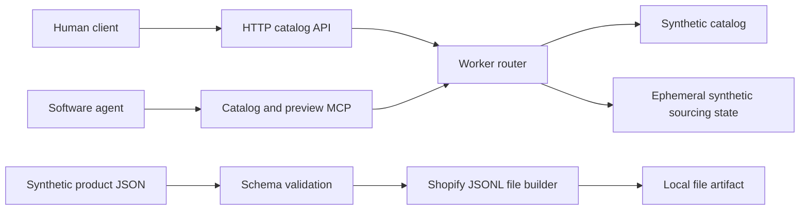

# Architecture

## Scope

The public project demonstrates a read-only agent-ready catalog plus a guarded
synthetic sourcing lifecycle. It deliberately stops before production identity,
payment, ordering, procurement, fulfillment, and private product-governance
systems.

## Request Flow

1. The Worker assigns a request identifier.
2. Browser origins are checked against `ALLOWED_ORIGINS`.
3. Request paths, methods, sizes, and parameters are validated.
4. The router calls pure catalog functions or the MCP dispatcher.
5. Authenticated sourcing calls validate plan, criteria, destination,
   idempotency key, ownership, cursor, and quota before touching demo state.
6. Responses receive no-store caching and defensive security headers.

There is no runtime database and no external network request. Synthetic tasks
live only in one Worker isolate and disappear on restart. This cannot lose a
business transaction because the public demo performs no business transaction.
The displayed lifecycle is completed synchronously as a contract fixture; it is
not evidence of an asynchronous production workflow.

## Module Boundaries

- `src/catalog.js`: immutable synthetic products, ranking, and pagination.
- `src/http.js`: HTTP limits, CORS, identifiers, headers, and safe errors.
- `src/mcp.js`: JSON-RPC dispatch for catalog and synthetic sourcing tools.
- `src/sourcing.js`: bearer authorization, scoped preview access, ephemeral
  idempotency, task ownership, lifecycle fixtures, and result pagination.
- `src/index.js`: routing and response composition.

Provider integrations should be implemented behind separate interfaces in a
downstream project. Do not add private endpoints or credentials to this public
repository.
