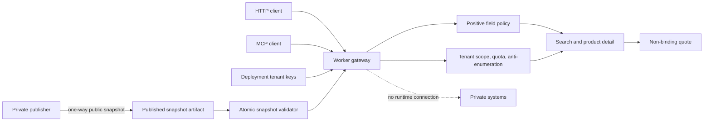

# Architecture

## Scope

Agent Core is a deployable boundary between a pre-published product snapshot
and external HTTP or MCP clients. The gateway validates input, resolves a
tenant, applies product scope and quota controls, and returns only public
allowlisted fields.

The snapshot arrow is one-way. The public gateway has no credential, route, or
runtime connection back to the private publishing environment.

## Runtime request flow

1. The Worker assigns a request identifier and validates the browser origin.
2. `/health`, MCP `initialize`, and MCP `tools/list` remain public.
3. Data requests resolve a tenant from the deployment-injected key registry
   using constant-time comparison.
4. The tenant's page limit, daily quota, product identifiers, and enumeration
   policy are applied.
5. Catalog functions read the in-memory validated snapshot.
6. Every product is rebuilt through `toPublicProduct`; unknown fields are not
   copied into the response.
7. Browsing responses include snapshot `as_of`. Quote requests fail when the
   active snapshot is stale and otherwise expire after 15 minutes.

## Module boundaries

- `src/field-policy.js`: positive public product field policy.
- `src/snapshot.js`: pure validation and atomic activation of snapshot data.
- `src/tenant.js`: tenant key resolution, scopes, page limits, and reference quota counter.
- `src/catalog.js`: tenant-filtered ranking, pagination, and detail lookup.
- `src/quote.js`: short-lived non-binding quote contract.
- `src/http.js`: request limits, CORS, response headers, and safe errors.
- `src/mcp.js`: public discovery and authenticated tool dispatch.
- `src/sourcing.js`: optional fixture preview lifecycle with no commerce writes.
- `src/index.js`: HTTP routing and error boundaries.

## Deliberate limitations

- The sample snapshot is compiled into the Worker. Runtime filesystem access is
  not available and runtime network access is prohibited.
- Tenant keys and quota counters are Phase 1 adapters. A multi-isolate
  production deployment needs durable identity and counters.
- Quotes are non-binding and use the current snapshot price. No reservation,
  inventory mutation, or checkout is created.
- The fixture sourcing lifecycle is in-memory, non-billable, and
  non-purchasable.

Private publishers and write-capable commerce systems belong in separate,
independently reviewed repositories.
