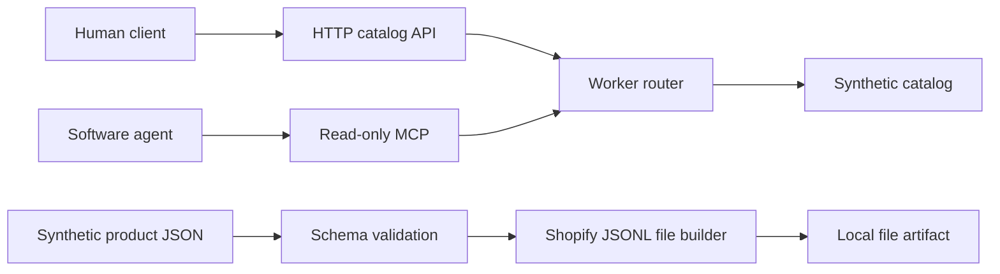

# Architecture

## Scope

The public project demonstrates the read-only edge of an agent-ready catalog.
It deliberately stops before identity, payment, ordering, procurement,
fulfillment, and private product-governance systems.

## Request Flow

1. The Worker assigns a request identifier.
2. Browser origins are checked against `ALLOWED_ORIGINS`.
3. Request paths, methods, sizes, and parameters are validated.
4. The router calls pure catalog functions or the MCP dispatcher.
5. Responses receive no-store caching and defensive security headers.

There is no runtime database and no external network request. Restarting the
Worker cannot lose a business transaction because the public demo has no
business transactions.

## Module Boundaries

- `src/catalog.js`: immutable synthetic products, ranking, and pagination.
- `src/http.js`: HTTP limits, CORS, identifiers, headers, and safe errors.
- `src/mcp.js`: JSON-RPC dispatch for the two read-only tools.
- `src/index.js`: routing and response composition.

Provider integrations should be implemented behind separate interfaces in a
downstream project. Do not add private endpoints or credentials to this public
repository.
